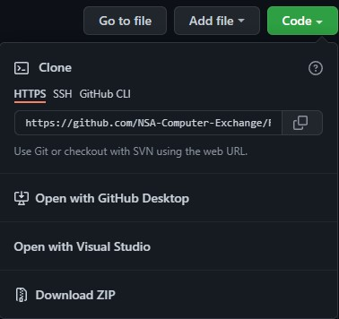

## Python OAuth2 API Request Example

## Commands

`python python_authtoken_apirequest.py` - Run the script.

## Setup

The simplest way to get started is to clone this repository to a local directory.  
`git clone https://github.com/NSA-Computer-Exchange/Python_OAuth2.0_APIRequest_Example`

## Download

If you don't have git installed, you can download the files in .zip format:

* Expand the green "Code" button.
* Select __Download ZIP__ at the bottom.

For more information on cloning a repository, here's a good read: [Cloning a repository](https://docs.github.com/en/repositories/creating-and-managing-repositories/cloning-a-repository)

## Project layout

    python_authtoken_apirequest.py  # The python script.
    docs/
        index.md                    # The documentation homepage.
        docs/mkdocs.yml             # The mkdocs configuration file.                              
        ...                       

## Python OAuth2.0 APIRequest Example

This file is a working example of how you can request an access token from your tenants access token url and use that token to make an API request.

Be sure to update the sections in the script file like this: __<< SAAK value from .ionapi >>__ to use your credentials from the .ionapi file you downloaded when you created a backend service.  

## Replace the values in the script that begin and end with << >>

    ###  Step 1 - Define auth URL, Endpoint URL, Payload and Credentials  ###

    # PU + OT - Replace with your tenants token URL
    token_url = "https://mingle-sso.inforcloudsuite.com:443/<< REPLACE WITH YOUR TENANT >>/as/token.oauth2"

    # Endpoint URL - Can get from swagger documentation in IONAPI - Replace with your tenants API URL
    test_api_url = "https://mingle-ionapi.inforcloudsuite.com/<< REPLACE WITH YOUR TENANT >>/SX/rest/serviceinterface/proxy/FetchWhere"

    # IONAPI Request - Replace payload with your own request
    payload = """{
              "CompanyNumber": << YOUR CONO >>,
              "Operator": "<< YOUR SASO USERID >>",
              "TableName": "<< TABLE TO QUERY >>",
              "WhereClause": "",
              "BatchSize": 0,
              "RestartRowID": ""
             }"""

## Running the script: 
1. Update the sections mentioned above  
2. In your python interpreter type: __python python_authtoken_apirequest.py__  
3. If you get module not found errors, ensure you have the requests and urllib3 libraries installed and/or your environment is setup correctly.  
4. You can install the required libraries bu running `pip install << required library >>`

If you have any trouble running the script, feel free to contact us at: [support@nsacom.com](mailto:support@nsacom.com)